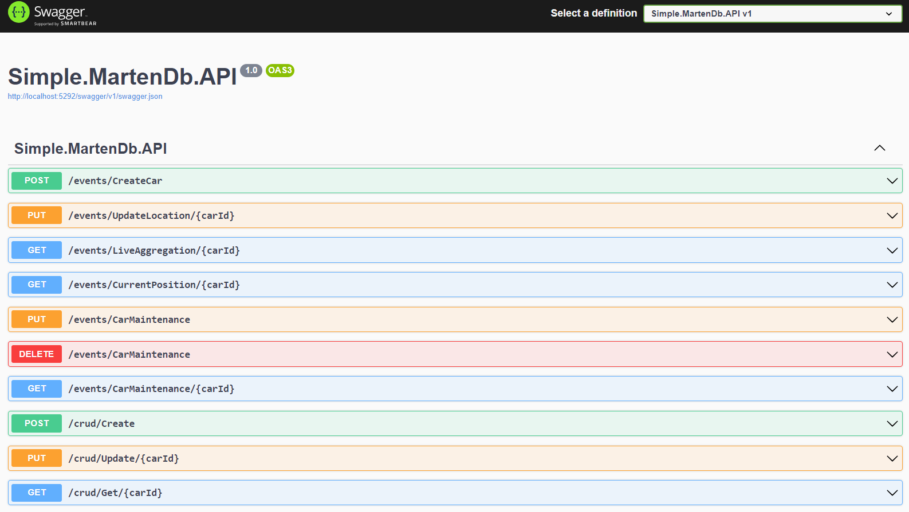
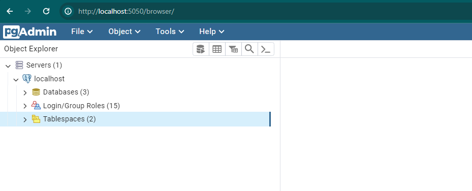
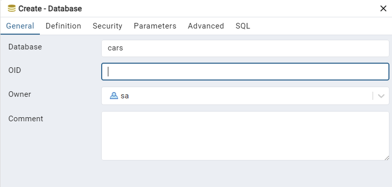

# SimpleMartenDb

A simple implementation of MartenDB. MartenDB is a .NET Transactional Document DB and Event Store on PostgreSQL.
For more information about MartenDB, visit [here](https://github.com/JasperFx/marten).

Upon starting the application, you will be greeted with a Swagger page, offering a user-friendly interface to explore and interact with the API endpoints effortlessly.
Here a sample:



This API project is structured to provide two families of endpoints: 
 - CRUD (Create, Read, Update, Delete) operations 
 - Events

The CRUD endpoints are crafted to demonstrate the utilization of MartenDB for performing standard CRUD operations.
These endpoints will illustrate how easy it is to create, read, update, and delete using MartenDB's features.

Additionally, the Events endpoints are specifically designed to showcase the power of MartenDB in implementing an EventSource approach. 
By leveraging MartenDB's event sourcing capabilities, these endpoints demonstrate how events can be captured and managed efficiently.

## Event Sourcing

The Event Store pattern is a method used in software architecture to manage the state of an application by recording the full history of events that have occurred. Instead of storing the current state of an object or system, the Event Store maintains a log of all changes or events that have happened over time. These events represent actions or occurrences that have affected the system's state.

Event Sourcing is a software design pattern that involves capturing all changes to an application's state as a sequence of events. Instead of storing the current state of an entity, Event Sourcing involves storing a log of events that describe the actions or commands that have been applied to that entity over time. These events are immutable, meaning they cannot be changed once they are recorded.

For more details, refer to [Microsoft's documentation on Event Sourcing](https://learn.microsoft.com/en-us/azure/architecture/patterns/event-sourcing).


## Prerequisites for Testing

### How to Set up PostgreSQL

If you don't have PostgreSQL installed, you can use the "docker-compose.yml" file inside the docker folder.

The Docker Compose file will configure:
1. An instance of PostgreSQL reachable on port 5432
2. An instance of pgAdmin reachable on port 5050

You can configure your username and password by editing the ".env" file inside the "docker/config/" folder.

### Create DB on Postgress using PGAdmin

Open the admin page and follow the steps to create a database.





# Code Explaination

## MartenDb Setup

Here how to make the first configuration of marten:

```csharp
builder.Services.AddMarten(options =>
{
    const string connectionString = "host=localhost;port=5432;database=cars;username=sa;password=MySecretPassword1234;";
    options.Connection(connectionString);
});
```

## Database Interaction

IQuerySession: for read operation
IDocumentStore: for write operation


### CRUD Endpoints

Sample read:

```csharp
app.MapGet("Get/{carId}", async (Guid carId, IQuerySession querySession) =>
{
    return await querySession.Query<CarEntity>().Where(x => x.Id == carId).FirstOrDefaultAsync();
}).WithOpenApi();
```

Sample Write:

```csharp
using var session = await store.LightweightSerializableSessionAsync();
session.Store(new CarEntity() { Id = carId, CurrentPosition = new Location(0, 0), InitialPosition = new Location(0, 0), Traveled = 0 });
await session.SaveChangesAsync();
```

### Events

Start a stream (a stream cannot start without an event):

```csharp
session.Events.StartStream(carId, new UpdateLocationRequest() { Latitute = 0, Longitude = 0 }); 
```
enquee event with same id
```csharp
 using var session = await store.LightweightSerializableSessionAsync();
 session.Events.Append(carId, request);
 await session.SaveChangesAsync();
```

SetUp a simple entity with event connection:

```csharp
public class CarAggregateEntity
{

    public Guid Id { get; set; }

    public Location? InitialPosition { get; set; }

    public Location CurrentPosition { get; set; }

    public int Traveled { get; set; }

    public void Apply(UpdateLocationRequest e)
    {
        if (InitialPosition == null)
            InitialPosition = new Location(e.Latitute, e.Longitude);

        CurrentPosition = new Location(e.Latitute, e.Longitude);
        Traveled += e.Longitude; //just a sample traveled calculation
    }
}
```

using AggregateStreamAsync method all events we got the final states:

```csharp
await querySession.Events.AggregateStreamAsync<CarAggregateEntity>(carId);
```


### Projections

How to setup projection on mattern:

```csharp
builder.Services.AddMarten(options =>
{
    const string connectionString = "host=localhost;port=5432;database=cars;username=sa;password=MySecretPassword1234;";
    options.Connection(connectionString);
    options.Projections.Add(new CarMaintenanceEventProjection(), ProjectionLifecycle.Async);
    options.Projections.Add(new CurrentCarPositionEventProjection(), ProjectionLifecycle.Async);
})
.AddAsyncDaemon(DaemonMode.Solo);
```

//TODO Add explaination about AddAsyncDaemon

//TODO Add sample of projection flow


